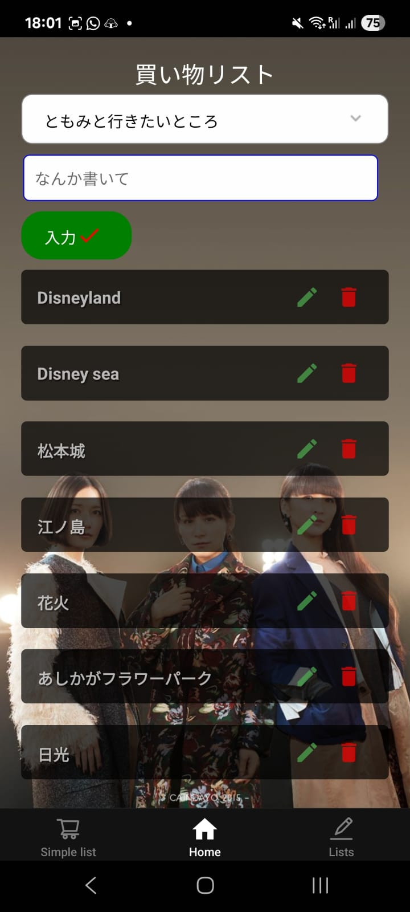
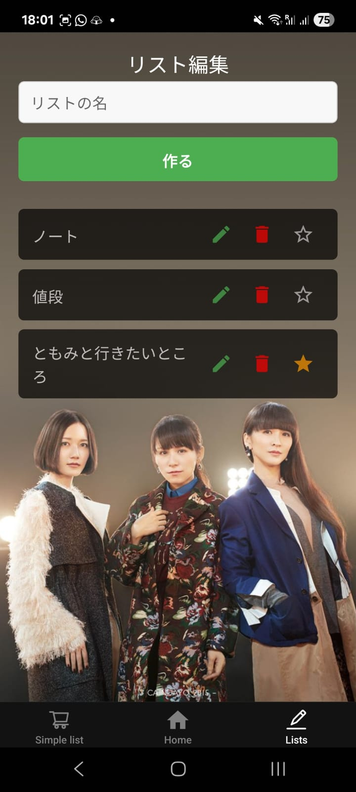

# Welcome to kaimono list

Build your own shopping list, cross the ones you already bought, create, edit, delete items on a simple list.  
Or make multiple lists, establish a default one and manage them all easily.

## Examples

  
  
  

